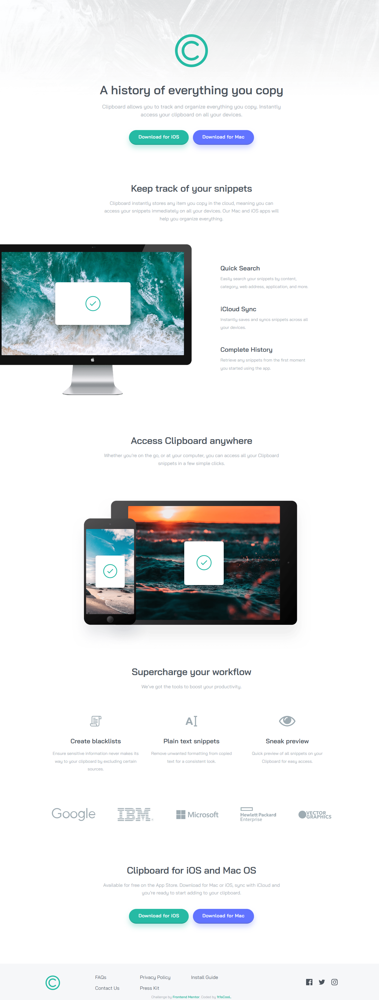

# Frontend Mentor - Clipboard landing page solution

This is a solution to the [Clipboard landing page challenge on Frontend Mentor](https://www.frontendmentor.io/challenges/clipboard-landing-page-5cc9bccd6c4c91111378ecb9). Frontend Mentor challenges help you improve your coding skills by building realistic projects.

## Table of contents

- [Overview](#overview)
  - [The challenge](#the-challenge)
  - [Screenshot](#screenshot)
  - [Links](#links)
- [My process](#my-process)
  - [Built with](#built-with)
  - [What I learned](#what-i-learned)
- [Author](#author)

## Overview

### The challenge

Users should be able to:

- View the optimal layout for the site depending on their device's screen size
- See hover states for interactive elements

### Screenshot



### Links

- Solution URL: [Vercel](https://clipboard-landing-page-master-khaki.vercel.app/)
- Live Site URL: [mmalabugin.ru/ClipboardLandingPage/](https://mmalabugin.ru/ClipboardLandingPage/)

## My process

### Built with

- Semantic HTML5 markup
- CSS custom properties
- Flexbox
- CSS Grid
- Mobile-first workflow
- [Angular](https://angular.dev/) - standalone components, signals
- Self-hosted [Bai Jamjuree](https://fonts.google.com/specimen/Bai+Jamjuree) (400/600) with `font-display: optional`

### What I learned

- Animated footer: staggered fade-up entrance driven by an `IntersectionObserver` wired through an Angular signal, hover micro-interactions (links turn green with a growing underline, social icons lift and recolor via CSS `mask`, the logo playfully tilts). All animations respect `prefers-reduced-motion`.
- Angular component styles are scoped by default — shared classes like the section lead paragraph must live in the global stylesheet, otherwise sibling components silently render unstyled.
- When overriding an `` width in CSS while keeping the HTML `width`/`height` attributes (for layout stability), `height: auto` is required — otherwise the attribute height wins and distorts the image.

## Author

- Website - [mmalabugin.ru](https://mmalabugin.ru/)
- Frontend Mentor - [@1t1sCooL](https://www.frontendmentor.io/profile/1t1sCooL)
- Twitter - [@vi_el_mar](https://www.twitter.com/vi_el_mar)
- Telegram - [@ItIsCooL](https://t.me/ItIsCooL)

This project was generated using [Angular CLI](https://github.com/angular/angular-cli).

## Getting Started

First, run the development server:

```bash
npm start
```

Open [http://localhost:4200](http://localhost:4200) with your browser to see the result.

## Building

To build the project run:

```bash
npm run build
```

This will compile your project and store the build artifacts in the `dist/` directory. On the `deploy` branch the build is configured with the `/ClipboardLandingPage/` base href for self-hosting behind nginx.

## Deploy on Vercel

The `main` branch builds with the default base href and deploys to the [Vercel Platform](https://vercel.com/) as a static Angular app (see `vercel.json` for the output directory).
